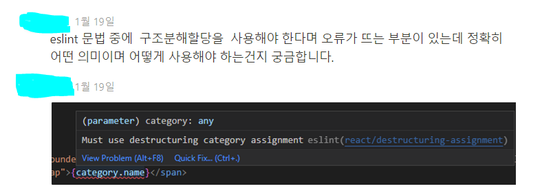

<nav>

목차

- 들어가며
- 구조 분해 할당이란
- 배열에서의 구조분해 할당
- 객체에서의 구조 분해 할당
- 질문에 대한 답

</nav>

### 들어가며

현재 참여중인 동아리 홈페이지 개발(프론트엔드) 프로젝트에 매주 회의마다 정해진 발표자들이 선정된 주제를 가지고 발표를 하는 규칙이 있다.

이번 주차 발표를 내가 맡게 되어서, 제기된 주제 중 하나였던 '구조분해할당이란?'을 가지고 발표를 준비하는 과정에서 정리한 내용을 포스팅 하기로 한다.

### 구조 분해 할당이란

> **구조 분해 할당** 구문은 배열이나 객체의 속성을 해체하여 그 값을 개별 변수에 담을 수 있게 하는 JavaScript 표현식입니다.
>
> \- docs에서 서술하고 있는 구조 분해 할당의 정의

>

간단히 말해, `배열` 혹은 `객체`에서 값(value) 또는 프로퍼티(property)를 **분해**하여 별도의 변수에 담을 수 있도록(=**할당**할 수 있도록) 지원하는 문법

### 배열에서의 구조분해 할당

아래 코드에서와 같이 할당받을 변수를 왼쪽에, 분해할 대상을 오른쪽에 해서 대입하는 형식

```jsx
let [a, b] = [10, 20]
console.log(a) // 10
console.log(b) // 20
```

배열 [10, 20]이 **분해**되어 각각 a, b에 담긴 것.

- 다른 사용 예시
  ```jsx
  const array = [1, 2, 3]
  //const first = array[0]; //기존 방식
  const [first] = array
  console.log(first) // 1
  ```

### 객체에서의 구조 분해 할당

```jsx
const obj = {
  name: "John",
  age: 18,
  memo: "Hello",
}
const { name, age, memo } = obj
console.log(name) // "John"
console.log(age) // 18
console.log(memo) // "Hello"

// 만약 구조 분해 할당을 사용하지 않는다면?
// 아래와 같이 직접 대입해 주어야 한다.
const name = obj.name
const age = obj.age
const memo = obj.memo
```

단, 분해되는 대상이 배열은 `array의 value(element)` 였다면, 객체는 분해되는 대상이 `객체의 property`

프로퍼티를 기준으로 구조 분해 할당하기 때문에, 배열과 달리 대상 프로퍼티의 **순서가 바뀌어도 문제가 없다**.

```jsx
const obj = {
  name: "John",
  age: 18,
  memo: "Hello",
}
// memo, name, age 순으로 작성해도 상관이 없다. 알아서 해당 프로퍼티명에 해당하는 값을 저장한다.
const { memo, name, age } = obj
console.log(name) // 'John'
console.log(age) // 18
console.log(memo) // 'Hello'

// 배열 구조 분해 할당의 경우 작성된 순서대로 배열의 값을 넣어준다.
const [a, b, c] = [10, 20, 30]
console.log(a, b, c) // 10 20 30
```

+) `…`**문법**을 함께 사용하여 다음과 같은 활용이 가능

다른 변수들에 할당되지 않은 나머지 요소들을 받아준다.

```jsx
let array = [1, 2, 3, 4, 5]
let [a, b, ...rest] = array
console.log(rest) // [3, 4, 5];
```

```jsx
const obj = {
  name: "John",
  age: 18,
  memo: "Hello",
}
const { name, ...rest } = obj
console.log(name) // "John"
console.log(rest) // { age : 18, memo: 'Hello' }
```

### 질문에 대한 답



해당 경고는 다음과 같이 코드를 작성하여 해결할 수 있을 것이다.

```jsx
const {name} = category;
....
return (
	...
	<span>{name}</span>
	...
)
}
```

<nav>
참고 게시글

- [https://developer.mozilla.org/ko/docs/Web/JavaScript/Reference/Operators/Destructuring_assignment](https://developer.mozilla.org/ko/docs/Web/JavaScript/Reference/Operators/Destructuring_assignment)
- [https://chanhuiseok.github.io/posts/js-10/](https://chanhuiseok.github.io/posts/js-10/)

</nav>
