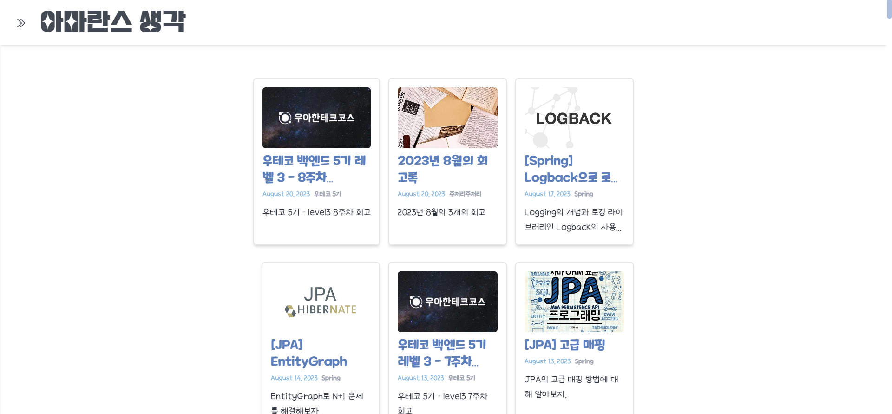

<aside>

회고

---

</aside>

우테코 레벨 3이 끝나고 약 열흘 간의 방학을 맞이했다.

이 블로그를 만든지도 1년이 되어간다. 조금씩 디자인을 고치고는 있었는데, 언젠가 디자인을 보니 여기저기 이상한 부분이 많이 보였다.


한 가지 예시를 들면, 메인 홈 화면을 내 화면에서 봤을 때는 적당히 가운데 정렬이 되어 있어서 문제없어 보였는데…


화면 배율을 조금 줄였더니 아래같이 왼쪽으로 치우친 배치가 되었다.

그렇다는 건 화면 비율이 다른 모니터에서는 저렇게 보일 수도 있다는 것이다.

과거의 내가 정말 코드를 대충 짰구나 생각이 들었다.

이런 문제를 포함해서 평소에 디자인적으로도 고치고 싶었던 부분이 있었어서, 이번 기회에 블로그 UI를 한 번 갈아엎어보기로 했다.

<aside>

이 글은 가이드보다는 일기같은 목적으로 작성한 글이기 때문에, 비슷한 작업을 하려는 분들께는 큰 도움이 되지 않을 수 있다는 점 참고 바란다.

</aside>

이번에 뜯어 고칠 건 크게 6가지이다.

1. 메인 홈 화면의 컨텐츠를 가운데로 정렬시킨다.
2. 내 프로필을 사이드바로 옮긴다.
3. 사이드바를 모바일에서 뿐만 아니라 상시로 접었다가 펼칠 수 있게 한다.
4. 태그 & 카테고리 페이지의 게시글 섹션의 섬네일 이미지 크기를 통일시킨다.

   사진을 보면 다음과 같이 타이틀 길이에 따라 섬네일 너비가 들쭉날쭉하다…

   

5. 날짜 별로 게시글을 볼 수 있는 캘린더 뷰를 만든다.
6. 스크롤 위치에 따라 진행도를 보여주는 UI를 만든다.

그럼 하나씩 해결해보기로 하자.

### 1. 메인 홈 화면 컨텐츠 정렬하기


우측의 TOC 공간을 없애주고, 좌측의 카테고리 사이드 바를 제외한 공간에서 가운데 정렬되도록 하였다.

### 2. 프로필을 사이드바로 옮기기 & 사이드바를 상시로 접었다 펼 수 있게 수정




### +) 사이드 바 스크롤 커스텀


[🌟 스크롤 바(Scrollbar) 스타일링 💯 총정리](https://inpa.tistory.com/entry/CSS-🌟-스크롤-바Scrollbar-꾸미기-속성-총정리)

이 글을 참고해서, 카테고리를 스크롤하는 동안에만 스크롤 바가 보이도록 커스텀하였다.

코드는 다음과 같다.

나는 블로그 전체의 스크롤바는 항상 보이게 하고, 내가 지정한 Element만 평소에 스크롤바가 보이지 않게 설정하려고 하였다.

```jsx
<ul
    className="scroll-box-hidden space-y-2 p-4 px-8 overflow-auto max-h-[calc(100vh-88px-15em)]"
    ref={scrollBox}
    onScroll={e => {
	      let window_scrolling
	      e.target.classList.remove("scroll-box-hidden")

	      clearTimeout(window_scrolling)
	      window_scrolling = setTimeout(() => {
		        window_scrolling = undefined
		        e.target.classList.add("scroll-box-hidden")
	      }, 400)
  }}
>
		...
```

```css
/*스크롤바 ui*/
*::-webkit-scrollbar {
  width: 10px;
  background-color: rgba(255, 255, 255, 0);
}
*::-webkit-scrollbar-thumb {
  background-color: rgb(86, 126, 185, 0.5);
  border-radius: 10px;
}

*::-webkit-scrollbar-track {
  background-color: rgba(0, 0, 0, 0);
  border-radius: 10px;
}
.scroll-box-hidden {
  transition: all 0.4s ease;
}
.scroll-box-hidden::-webkit-scrollbar-thumb {
  display: none;
}
```

### 3. 태그 & 카테고리 페이지의 게시글 섹션의 섬네일 이미지 크기를 통일시킨다.

전


후


### 4. 스크롤 위치에 따라 진행도를 보여주는 UI를 만든다.

뭘 어떻게 넣을지 모르겠어서 일단은 내 창작 캐릭터인 문어 사진을 넣어주었다.

스크롤 UI는 예전에 만든 적이 있어서 생각보다 금방 끝났다.


```jsx
const Header = ({ openCategory, setOpenCategory, title }) => {
  const [percentScr, setPercentScr] = useState(0)
  const handleScroll = () => {
    setPercentScr(
      (100 * Math.floor(window.pageYOffset)) /
        (document.documentElement.scrollHeight -
          document.documentElement.clientHeight)
    )
  }
  useEffect(() => {
    window.addEventListener("scroll", handleScroll)
    return () => {
      window.removeEventListener("scroll", handleScroll)
    }
  })

  return (
    <>
      <header className="flex flex-col bg-white sticky top-0 shadow-md 0 z-[99] opacity-90 backdrop-blur-lg">
        ...
        <div className="flex h-[50px] shadow-inner w-full">
          <div className="w-[50px] bg-sub"></div>
          <div
            className={`flex justify-end bg-sub rounded-r-full`}
            style={{ width: percentScr + "%" }}
          >
            <StaticImage
              className="bio-avatar bg-white rounded-full border border-sub"
              layout="fixed"
              formats={["auto", "webp", "avif"]}
              src="../images/profile-pic.png"
              width={50}
              height={50}
              quality={95}
              alt="Profile picture"
            />
          </div>
        </div>
      </header>
    </>
  )
}
```

### 5. 날짜 별로 게시글을 볼 수 있는 캘린더 뷰를 만든다.

사실상 이게 핵심이다.

[[🐾 일지] 리액트 달력 만들기](https://sennieworld.tistory.com/61)

위 글을 참고해서 만들었다.

날짜 별로 포스팅을 얼마나 많이, 자주 했는지 한 눈에 볼 수 있도록 캘린더를 만들었다.


짜잔~~

나중에 시간이 나면 태그 페이지, 카테고리 페이지처럼 날짜 별 게시글 목록을 볼 수 있는 페이지 템플릿을 추가할 예정이다.

오늘 하루를 블로그 갈아엎는 데 다 쓴 것 같다.

하지만 확실히 전보다 보기 좋아진 것 같아서 시간이 아깝지는 않다.
